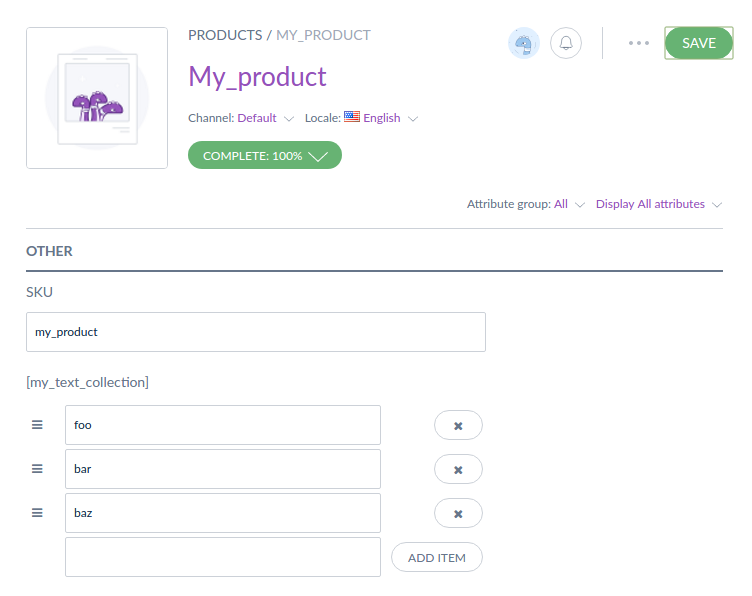

# ExtendedAttributeTypeBundle

Provides new attributes types for Akeneo PIM CE and EE:
- TextCollection: this attribute type can store an ordered collection of strings or URLs.



## Requirements

| ExtendedAttributeTypeBundle | Akeneo PIM Community Edition |
|:---------------------------:|:----------------------------:|
| 2.0.*, dev-master           | v2.*                         |
| 1.1.*                       | v1.7.*                       |
| 1.0.*                       | v1.6.*                       |

## Installation
You can install this bundle with composer (see requirements section).

First, add the VCS then launch the following command from your root application:
```
    php composer.phar require --prefer-dist akeneo/extended-attribute-type:2.0
```

Add the following bundle in your `app/AppKernel.php` file:

```php
$bundles = [
    new Pim\Bundle\ExtendedAttributeTypeBundle\PimExtendedAttributeTypeBundle(),
];
```

You will also have to register the new Elasticsearch configuration files; in `app/config/pim_parameters.yml`, edit the 
`elasticsearch_index_configuration_files` parameter and add the following values:

```yaml
elasticsearch_index_configuration_files:
    - '%kernel.root_dir%/../vendor/akeneo/pim-community-dev/src/Pim/Bundle/CatalogBundle/Resources/elasticsearch/index_configuration.yml'
    - '%kernel.root_dir%/../vendor/akeneo/extended-attribute-type/src/Resources/config/elasticsearch/index_configuration.yml'
```

For the Enterprise edition, there is another file to register:
```yaml
elasticsearch_index_configuration_files:
    - '%kernel.root_dir%/../vendor/akeneo/pim-community-dev/src/Pim/Bundle/CatalogBundle/Resources/elasticsearch/index_configuration.yml'
    - '%kernel.root_dir%/../vendor/akeneo/pim-enterprise-dev/src/PimEnterprise/Bundle/WorkflowBundle/Resources/elasticsearch/index_configuration.yml'
    - '%kernel.root_dir%/../vendor/akeneo/extended-attribute-type/src/Resources/config/elasticsearch/index_configuration.yml'
    - '%kernel.root_dir%/../vendor/akeneo/extended-attribute-type/src/Resources/config/elasticsearch/index_configuration_ee.yml'    
```

## Contributing

If you want to contribute to this open-source project,
thank you to read and sign the following [contributor agreement](http://www.akeneo.com/contributor-license-agreement/)
